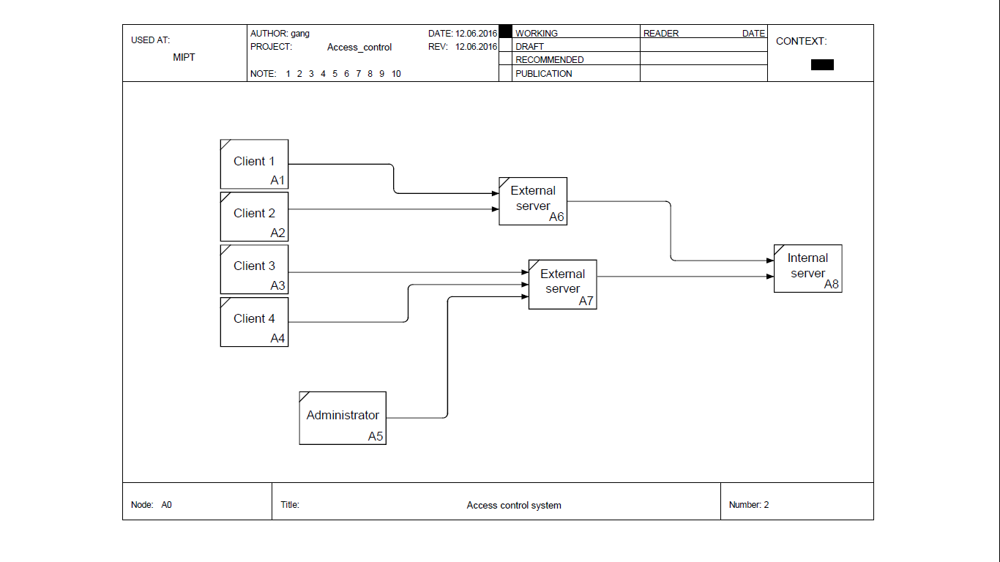

#Система контроля доступа с применением технологии BlockChain
#### Ефимов Юрий, Назаров Владимир, Нейчев Радослав
#### Июнь 2016

## Общая идея системы
Реализованная система предназначена для контроля и логгирования доступа клиентов к различным частям некоторой инфраструктуры. Для хранения и защиты данных была взята идея технологии BlockChain, что повышает надежность системы и её устойчивость к подменне данных.

## Архитектура
Система состоит из трех уровней:

  * Терминал. Имеет два уровня доступа:
    
    * Клиент. Базовый пользователь данной системы, права клиента выдаются всем автоматическим устройствам контроля доступа (например, турникеты и магнитные замки в случае реальной инфраструктуры некоторого объекта).
    
    * Администратор. Панели администратора позволяют получать доступ к истории событий, отслеживать перемещения клиентов и их действия. Также является клиентом, но обладающим правами администратора.
    
  * Внешний сервер. Система из нескольких внешних серверов, на которые ложится основная нагрузка по обработке входящей информации.
    
  * Внутренний сервер. Сервер, имеющий связь исключительно с внешними серверами. Существует в единственном виде. На этом сервере хранится история в виде цепочек.

Схематически архитектура системы приведена на Рис.1

## Сетевое взаимодействие
Сетевое взаимодействие между различными уровнями системы реализовано с помощью кроссплатформенного протокола XML-RPC. Данный протокол использует XML для кодирования своих сообщений и HTTP (HTTPS) в качестве транспортного механизма.

Взаимодействие в рамках одного уровня в текущей версии не реализовано.

## Документация возможностей
В данной секции приведены основные возможности каждого уровня системы.

#### Уровень терминала:
Терминал реализован как консольное приложение, по запуску он ожидает на вход одну из следующих команд. Команды и аргументы разделяются пробелом (space). Администратору доступны все команды, доступные клиенту.
  * Клиент:
    * Enter (string)client_id (int)location_id -> bool--- запрос на вход в локацию location_id от пользователя client_id.
    * Exit (string)client_id -> bool                  --- запрос на выход из текущей локации от пользователя client_id.
    * getStatistics -> string                         --- запрос строки состояния системы. Если одна из команд вернула False, содержит текст ошибки. В противном случае содержит пустую строку.
    * quit -> NULL                                    --- завершение сеанса терминала.
  * Администратор:
    * getLocation (string)admin_id (string)client_id (datetime)at -> int  --- возвращает location_id, в которой находился клиент client_id в момент времени at. В случае ошибки возвращает число меньше 1.
    * getUsers (string)admin_id (int)location_id (datetime)at -> list[string] --- возвращает список client_id клиентов, находившихся в локации location_id в момент времени at. 
    * createLocation (string)admin_id -> int          --- создает новую локацию. Если локация создана, возвращается ее location_id. В случае ошибки возвращает число меньше 1.
    * createUser (string)admin_id -> string           --- создает нового пользователя. Если пользователь создан, возвращается строка, содержащая его client_id. В противном случае произошла ошибка.
    * upgradeUser (string)admin_id (string)client_id -> bool --- присваивает пользователю client_id права администратора. В случае возврата True - операция успешна, иначе произошла ошибка.
    * downgradeUser (string)admin_id (string)client_id -> bool --- лишает пользователя client_id прав администратора. В случае возврата True - операция успешна, иначе произошла ошибка.

#### Уровень внешнего сервера

Внешние сервера занимаются обработкой данных. При запуске создаётся подключение к данному серверу по протоколу XML-RPC и ожидаются команды от клиентов системы. Полученные от клиентов команды внешний сервер обрабатывает, используя доступные ему функции внутреннего сервера по взаимодействию с цепочками событий BlockChain. На внешний сервер ложатся лишь задачи обновления полученной от внутреннего сервера цепочки или извлечения из неё актуальной информации. На основании полученной информации внешний сервер выдаёт ответ клиенту в соответстви с вызванной функцией. Для данного сервера сохраняется лог описания последних ошибок в системе в глобальном списке, чтобы по требованию пользователя вывести подробный отчёт об ошибке.
Допустимые команды:
	* Enter (string)client_id (int)location_id -> bool --- запрос на вход в локацию location_id от пользователя client_id. С внутреннего сервера получается актуальная цепочка событий, затем проверяется, были ли созданы данный пользователь и данная локация ранее. Если да --- проверяется, не находится ли пользователь в другой локации. Если нет --- возвращается True и в актуальную цепочку событий дописывается звено с данными о входе данного пользователя в данную локацию. Иначе --- возвращается False. Подробную причину ошибки можно узнать при помощи getStatistics().
	* Exit (string)client_id -> bool                  --- запрос на выход из текущей локации от пользователя client_id. Аналогично предыдущей функции, с внутреннего сервера получается актуальная цепочка событий, проверяется, были ли созданы данный пользователь и данная локация ранее. Если да --- проверяется, находится ли пользователь в какой-либо локации. Если да --- возвращается True и в актуальную цепочку событий дописывается звено с данными о выходе данного пользователя. Иначе --- возвращается False. Подробную причину ошибки можно узнать при помощи getStatistics().
	* getStatistics -> string                         --- запрос строки состояния системы. Возвращает информацию о последней случившейся на данном внешнем сервере ошибке. (?, проверьте меня тут)
	
	
#### Уровень внутреннего сервера

Внутренний сервер отвечает за хранение, защиту и предоставление доступа к данным. Хранение реализовано в виде цепочек блоков, где каждый блок сожержит дату своего создания, соотнесённого списка действий, свой хэш и хэш предыдущего по цепочке блока. Хэширование производится по всей информации из блока с помощью криптографической хэш-функции SHA-224. Первый блок в цепочке не имеет ссылки.

Для упрощения вычислений на внешних серверах, цепочки могут периодически или по команде *"сворачиваться"* --- при этом удаляется максимальное число событий так, чтобы итоговое состояние оказалось тем же самым (большинству команд не обязательно знать последовательность всех событий, достаточно состояния). Следующий пример это пояснит: пусть есть цепочка *createUser(user_id) - enter(user_id, place_id) - exit(user_id, place_id) - upgradeUser(user_id) - enter(user_id, place_id)*, тогда она может быть заменена на цепочку *createUser(user_id) - upgradeUser(user_id) - enter(user_id, place_id)*, так как возможность выполнить команды *enter*/*exit*, например, не зависит от всех входов и выходов в прошлом, мы можем зайти в локацию, только если не находимся при этом в другой локации. Однако, для команд *getLocation* и *getUsers* важна последовательность выполнения действий, для этого на сервере реализуется архивация старых цепочек.

Для нужд внешних серверов поддерживаются следующие команды:

1. getChain -> list[block]                            --- возвращает актуальную на данный момент цепочку
2. getChainAt (datetime)at -> list[block]             --- возвращает актуальную на момент *at* цепочку
3. addBlock (block)block -> boolean                   --- добавляет блок в конец текущей цепочки
4. getDiagnostics -> string                           --- то же самое, что и на внешнем сервере
